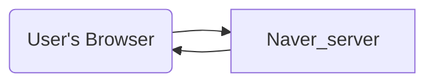

1. User 가 사용자 인터페이스를 사용하여 네이버 도메인을 입력하면 브라우저는 네이버 서버와 통신하여 HTML, CSS, JS, IMG, 영상 등  네이버의 메인 페이지를 렌더링 하기위해 필요한 리소스를 응답받는다.
2. User 의 브라우저 렌더링 엔진은 응답받은 HTML, CSS 파일을 해석하여 HTML 파싱, 배치, 그리기 작업을 완료한다. 또한 자바스크립트 해석기에 의해 동적으로 Dom 을 제어하기도 한다.
3. 사용자는 1차로 렌더링된 화면을 보거나(비동기로 네이버 서버와 통신이 계속 이어지고 있는 경우) 렌더링이 완전히 끝난 웹페이지를 본다.