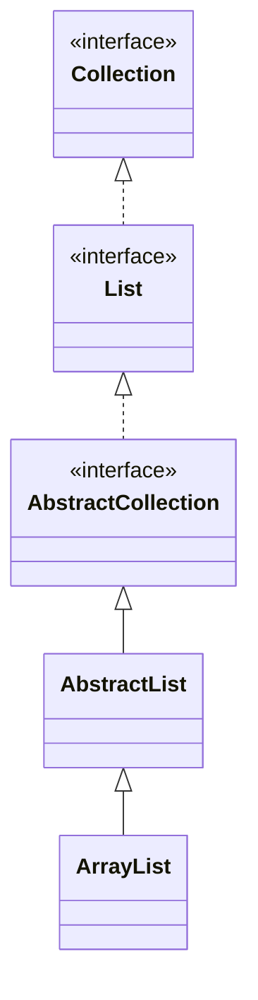

### Q) 본인이 주력으로 사용하는 언어에서 자료구조와 관련 된 클래스가 내부적으로 어떻게 동작하는지 한 가지 사례를 정하여 작성해주세요. ex) ArrayList, HashMap 등등

### ArrayList

### \<<interface\>> Collection
1. Query Operations
2. Modification Operations
3. Bulk Operations
4. Comparison and hashing

ArrayList 의 클래스 구조도를 보면 최상위에 Collections 인터페이스가 존재한다.   
콜렉션 인터페이스에는 일련의 객체들을 다루는 기능이 명세되어있다. 크게 쿼리, 수정, 벌크, 비교 기능을 명세하고 있다. 이 기능들은 Collection 인터페이스를 상속하는 클래스들의 공통된 기능인 것이다. 

이 최상위 Collection 인터페이스의 자손 클래스는 List, Set, Queue 등이 있으며 각 자손 클래스들마다 일련의 객체들을 다루는 방법이 다르다.
List 인터페이스의 특징은 선형 구조이다. 연속되는 메모리에 데이터의 주소값을 기억한다. 리스트의 첫번째 원소의 주소값에+1, +2, +3... 하는 방식으로 다음 데이터에 접근한다.
또한 null 을 허용하며, 중복된 데이터를 담는 것도 허용한다.

ArrayList는 표준 Collection 클래스 중 하나이며 AbstractList 클래스를 확장하고 List 인터페이스를 구현한다.
동적 배열을 만드는 데 사용된다.
> ArrayList 클래스를 사용하여 만든 목록은 객체 배열에 불과합니다.   
> Java에서는 표준 배열의 길이가 고정되어 있으므로 사전에 배열의 크기를 알아야합니다. 그러나 런타임까지 필요한 배열의 길이를 모를 수도 있습니다.   
> 따라서 Collection 프레임 워크는이 문제를 극복하기 위해 ArrayList 클래스를 도입했습니다.  
> 
> 출처: https://ko.gadget-info.com/difference-between-list  
 
  
##내부적으로 ArrayList 가 어떻게 인스턴스화 되고, 작동하는지 살펴보자.

### ArrayList  생성자

~~~ java
    private static final Object[] DEFAULTCAPACITY_EMPTY_ELEMENTDATA = {};

    /**
     * The array buffer into which the elements of the ArrayList are stored.
     * The capacity of the ArrayList is the length of this array buffer. Any
     * empty ArrayList with elementData == DEFAULTCAPACITY_EMPTY_ELEMENTDATA
     * will be expanded to DEFAULT_CAPACITY when the first element is added.
     */
    transient Object[] elementData; // non-private to simplify nested class access
~~~

ArrayList 클래스 전역변수에 Object 타입의 배열이 선언되어 있다.  
ArrayList는 내부적으로 배열로 관리됨을 알 수 있다. 
생성자는 파라미터로 배열의 크기를 기정해주거나 빈배열을 생성할 수 있다. 

~~~ java
    public ArrayList(int initialCapacity) {
        if (initialCapacity > 0) {
            this.elementData = new Object[initialCapacity];
        } else if (initialCapacity == 0) {
            this.elementData = EMPTY_ELEMENTDATA;
        } else {
            throw new IllegalArgumentException("Illegal Capacity: "+
                                               initialCapacity);
        }
    }

    /**
     * Constructs an empty list with an initial capacity of ten.
     */
    public ArrayList() {
        this.elementData = DEFAULTCAPACITY_EMPTY_ELEMENTDATA;
    }
~~~

### ArrayList 동적 배열 
리스트에 add 메서드를 통해 데이터를 추가해도 아무런 문제가 없다. 위에서 ArrayList 가 내부적으로 배열로 관리된다 했는데,  
어찌하며 에러가 발생하지 않는지 add 메서드를 까보자. 
~~~ java
 List<Integer> list = new ArrayList<>();
 list.add(2);
 list.add(3);
 list.add(4);
 ...
 list.add(1000);
~~~

아래 add 메서드의 인자값중 size는 클래스 전역변수이며 elementData 의 길이값을 담는다.
private add 메서드에 추가할 데이터, 전역변수로 선언된 배열, 현재의 배열 길이값을 인자로 전달한다.
~~~ java
    /**
     * Appends the specified element to the end of this list.
     *
     * @param e element to be appended to this list
     * @return {@code true} (as specified by {@link Collection#add})
     */
    public boolean add(E e) {
        modCount++;
        add(e, elementData, size);
        return true;
    }
~~~

현재 배열의 길이값을 담고있는 변수 s와 배열의 길이가 같으면 grow()메서드에서 리턴된 인스턴스를 배열에 할당한다.
그 후에 배열에 값을 추가하고, size 변수 값을 갱신한다. grow() 메서드에서 배열의 길이가 동적으로 늘어났음을 추측해볼 수 있다. 
~~~ java
    /**
     * This helper method split out from add(E) to keep method
     * bytecode size under 35 (the -XX:MaxInlineSize default value),
     * which helps when add(E) is called in a C1-compiled loop.
     */
    private void add(E e, Object[] elementData, int s) {
        if (s == elementData.length)
            elementData = grow();
        elementData[s] = e;
        size = s + 1;
    }
~~~

newCapacity 메서드를 통해 현재 배열의 크기의 50% 증가된 배열 길이로 관리된다. 
배열의 크기는 MAX_ARRAY_SIZE 를 넘지 않도록 하며 넘을 경우 에러 발생한다. 

~~~ java
    private Object[] grow() {
        return grow(size + 1);
    }
    
    /**
     * Increases the capacity to ensure that it can hold at least the
     * number of elements specified by the minimum capacity argument.
     *
     * @param minCapacity the desired minimum capacity
     * @throws OutOfMemoryError if minCapacity is less than zero
     */
    private Object[] grow(int minCapacity) {
        return elementData = Arrays.copyOf(elementData,
                                           newCapacity(minCapacity));
    }
    
    /**
     * Returns a capacity at least as large as the given minimum capacity.
     * Returns the current capacity increased by 50% if that suffices.
     * Will not return a capacity greater than MAX_ARRAY_SIZE unless
     * the given minimum capacity is greater than MAX_ARRAY_SIZE.
     *
     * @param minCapacity the desired minimum capacity
     * @throws OutOfMemoryError if minCapacity is less than zero
     */
    private int newCapacity(int minCapacity) {
        // overflow-conscious code
        int oldCapacity = elementData.length;
        int newCapacity = oldCapacity + (oldCapacity >> 1);
        if (newCapacity - minCapacity <= 0) {
            if (elementData == DEFAULTCAPACITY_EMPTY_ELEMENTDATA)
                return Math.max(DEFAULT_CAPACITY, minCapacity);
            if (minCapacity < 0) // overflow
                throw new OutOfMemoryError();
            return minCapacity;
        }
        return (newCapacity - MAX_ARRAY_SIZE <= 0)
            ? newCapacity
            : hugeCapacity(minCapacity);
    }
~~~
